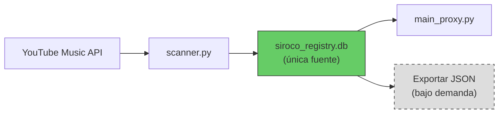
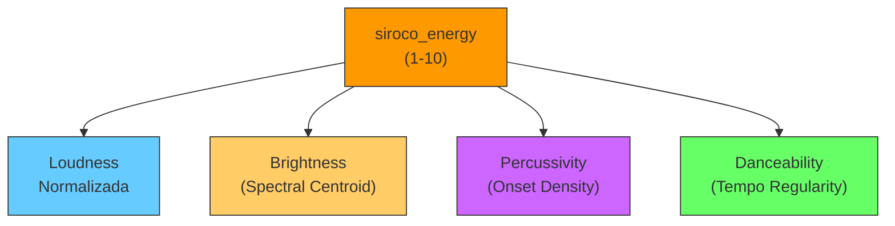

# Análisis Profundo: Arquitectura de Datos y Rediseño de Métrica de Energía

---

## Parte I: ¿Es necesario `siroco_playlist.json` como fuente de verdad?

### Estado Actual — Dos fuentes paralelas


Actualmente, los datos viven en **dos lugares** con esquemas distintos:

| Aspecto | JSON (`siroco_playlist.json`) | DB (`siroco_registry.db`) |
|:--|:--|:--|
| Rol declarado | "Source of truth" de la playlist | Registry de análisis |
| Campos exclusivos | `analysis.danceability`, `energy` (raíz, mock) | `status`, `last_analyzed`, `file_path_metadata` |
| Campos compartidos | `videoId`, `title`, `artists`, `album`, `duration`, `popularity`, `demographic`, `tags` | Mismos campos |
| Se actualiza con análisis | **No** — el bloque `analysis{}` nunca se escribe post-Librosa | **Sí** — `bpm`, `key`, `energy_rms`, `duration` |
| Tamaño | 364KB y creciendo | 135KB |

### Veredicto: El JSON debe **eliminarse** como fuente de verdad

> [!IMPORTANT]
> El JSON no cumple una función que la DB no pueda cumplir, y introduce problemas activos de sincronización.

**Razones concretas:**

1. **Duplicación sin valor**: Todo lo que el JSON almacena ya está (o debería estar) en la DB. Los campos de metadata (`title`, `artists`, `album`, `playlist`) se insertan en la DB via `add_track_metadata()` antes de cualquier análisis.

2. **Los datos "curados" en el JSON son mock**: Los campos `popularity`, `demographic` y `energy` que aparecen llenos en ~30 tracks son valores mock sin rigor y sin mecanismo de actualización.

3. **El bloque `analysis{}` del JSON está permanentemente vacío**: Nunca se actualiza post-análisis (las features se escriben solo en la DB). Esto genera confusión sobre dónde reside la verdad.

4. **El campo `energy` en la raíz del JSON es redundante**: Existe tanto `energy` (mock, raíz) como `analysis.energy` (siempre null), generando ambigüedad respecto a `energy_rms` en la DB.

5. **Tamaño y performance**: A 733 tracks, el JSON ya pesa 364KB y se carga completo en memoria. A 5,000 tracks será inmanejable vs. queries SQLite indexadas.

### Propuesta: DB como Única Fuente de Verdad



El flujo propuesto:

1. `scanner.py` **sincroniza directo con la DB**: Inserta/actualiza metadata de tracks que vienen del API de YouTube Music, sin intermediario JSON.
2. `main_proxy.py` **consulta la DB** para obtener la lista de tracks pendientes de análisis.
3. Si en algún momento se necesita un JSON (para exportar data a otra herramienta), se genera **como vista derivada** de la DB, no como fuente primaria.
4. El JSON puede mantenerse **opcionalmente** como snapshot de respaldo, pero nunca como input del pipeline.

---

## Parte II: Aproximación para `popularity`, `demographic`, `tags` y `genre`

### II.A — `popularity`: Derivar de datos reales del API

**Fuente de datos disponible:** `ytmusicapi.get_song(videoId)` retorna un campo `viewCount` (número de reproducciones). Este es el dato más robusto de "popularidad" disponible sin APIs externas.

**Propuesta de cálculo:**

```
popularity_score = percentil del viewCount relativo al resto del dataset
```

| Enfoque | Descripción | Pros | Contras |
|:--|:--|:--|:--|
| **A. Percentil relativo** | Calcular el percentil del `viewCount` de cada track vs. toda la playlist. Escalar a 1-100. | Simple, relativo a TU playlist | Requiere re-calcular cuando se agregan tracks |
| **B. Escala logarítmica absoluta** | `score = min(log10(viewCount) * 10, 100)`. Un track con 1M views ≈ 60, con 100M ≈ 80. | No requiere recálculo, comparable entre playlists | Tracks con <1000 views quedan muy bajos |
| **C. Híbrido** | Usar escala logarítmica pero ajustar rangos para DJ: `low` (<10K), `medium` (10K-1M), `high` (>1M) como categoría, más el score numérico. | Semántico y numérico | Más complejo |

> [!TIP]
> **Recomendación:** Opción **B (log)** como score numérico, complementada con un label categórico simple (`low`/`medium`/`high`/`viral`). Es predecible, no requiere recálculo, y es útil para el contexto DJ.

**Costo operacional:** `get_song()` es una llamada extra por track. Se puede hacer en batch como parte del pipeline de sync, con delays para evitar rate-limiting. Alternativamente, se puede ejecutar como un paso separado y secundario.

---

### II.B — `demographic`: Heurística basada en features del audio y metadata

El "demográfico" es inherentemente subjetivo, pero podemos aproximarlo como una **clasificación de contexto de escucha** basada en señales indirectas:

**Señales disponibles:**

| Señal | Fuente | Correlación |
|:--|:--|:--|
| BPM | Análisis Librosa | Tempos altos (>130) → "Party/Social" |
| Energía compuesta | Análisis (propuesto abajo) | Energía alta + BPM alto → "Social" |
| Año de release | `ytmusicapi` (campo `year`) | Tracks pre-2000 → más probable "Family/Nostalgia" |
| Idioma del título | Heurística NLP básica | Parsear si el título está en español, inglés, etc. |
| `isExplicit` | `ytmusicapi` playlist tracks | Contenido explícito → "Adult/Party" |

**Propuesta de clasificación (4 categorías):**

| Categoría | Criterio heurístico |
|:--|:--|
| `chill` | BPM < 100 AND energía < 5 |
| `social` | BPM 100-130 AND energía 5-7 |
| `party` | BPM > 130 OR energía > 7 |
| `intimate` | BPM < 90 AND spectral_centroid bajo (timbre suave) |

> [!NOTE]
> Esto NO es una solución perfecta — es una heurística razonable que se puede calibrar iterativamente contra tu criterio de DJ. La idea es generar un primer draft automático que luego puedas corregir manualmente donde haga falta.

---

### II.C — `tags`: Derivar automáticamente de metadata disponible

Los tags se pueden generar a partir de **tres fuentes que ya tienes**:

**Fuente 1 — Metadata del track:**

- Nombre del artista → tag de artista (e.g., `"ozzy-osbourne"`, `"buena-vista-social-club"`)
- Nombre del álbum → tag si es un álbum reconocido
- `videoType` del API (`MUSIC_VIDEO_TYPE_ATV`, `OMV`, `UGC`) → tags como `"official"`, `"user-generated"`, `"audio-only"`

**Fuente 2 — Features del análisis:**

- BPM band → tag automático: `"slow"` (<90), `"mid-tempo"` (90-120), `"uptempo"` (120-140), `"fast"` (>140)
- Key mode → tag: `"major-key"` o `"minor-key"`
- Energía (nueva métrica compuesta) → `"low-energy"`, `"high-energy"`

**Fuente 3 — Parsing del título:**

- Detectar patrones: `"(En Vivo)"` → `"live"`, `"(Cover)"` → `"cover"`, `"(Remix)"` → `"remix"`, `"(Official Video)"` → `"official-video"`, `"(Letra)"` → `"lyrics-video"`
- Idioma detectado del título → `"es"`, `"en"`, `"pt"`

**Estructura resultante en DB:**

```json
["slow", "minor-key", "official", "es", "buena-vista-social-club"]
```

---

### II.D — `genre`: Postergado (Fase 3+)

El género es complejo porque:

- `ytmusicapi` no expone género por track de forma confiable.
- Inferir género por audio requiere un clasificador ML entrenado (MusicNN, etc.).
- La alternativa es usar APIs externas (MusicBrainz, Last.fm, Discogs) para lookup por artista → género.

> [!NOTE]
> **Dejamos `genre` fuera de esta fase.** Cuando se aborde, la vía más pragmática será: lookup de género por artista vía MusicBrainz API (gratuita, no requiere auth) con cache agresivo en la DB. Un solo lookup por artista cubre N tracks.

---

## Parte III: Rediseño de la Métrica de Energía

### Diagnóstico del problema actual

La fórmula actual:

```python
rms = librosa.feature.rms(y=y)
rms_mean = np.mean(rms)
energy_score = int(min(max(rms_mean * 100, 1), 10))
```

Esto mide **solo volumen promedio** y lo escala con una fórmula ad-hoc que satura al 56% del dataset en el tope (E10). No es una métrica de "energía" musical — es un medidor de loudness sin normalizar.

### Propuesta: Métrica Compuesta de Energía (`siroco_energy`)

La energía musical percibida es una combinación de **cuatro dimensiones independientes**:



### Componente 1: Loudness Normalizada (peso: 25%)

**Problema actual:** RMS depende del gain/volume del video de YouTube, que es arbitrario.

**Solución:** Normalizar la señal **antes** de medir RMS.

```
Paso 1: Normalizar la señal a peak = 1.0
         y_norm = y / max(abs(y))

Paso 2: Calcular RMS sobre señal normalizada
         rms = librosa.feature.rms(y=y_norm)

Paso 3: Escalar con percentiles del dataset
         loudness_score = percentil_rank(rms_mean)
         → mapear a 1-10 vía percentiles (deciles)
```

**Por qué funciona:** Al normalizar el pico, eliminamos la variabilidad de gain entre videos. Lo que queda es la **dinámica** del audio — un track comprimido (pop moderno) tendrá RMS alto relativo al pico; un track con mucha dinámica (jazz, clásica) tendrá RMS bajo relativo al pico.

### Componente 2: Brightness / Spectral Centroid (peso: 25%)

El **spectral centroid** indica el "centro de masa" frecuencial de la señal. Un centroid alto = sonido brillante, metálico, agudo. Un centroid bajo = sonido cálido, grave, suave.

```
centroid = librosa.feature.spectral_centroid(y=y, sr=sr)
centroid_mean = np.mean(centroid)

# Normalizar a escala 1-10
# Valores típicos de centroid: ~1000-5000 Hz para música
brightness_score = escalar(centroid_mean, rango_esperado=[1000, 5000], a=[1, 10])
```

**Relevancia para DJ:** Un track "brillante" (mucha energía en agudos/medios-altos) se percibe como más energético que uno "oscuro" al mismo volumen. Piensa: hi-hats, sintetizadores agudos, vocal prominente → "energético".

### Componente 3: Percussivity / Onset Density (peso: 30%)

La **densidad de onsets** mide cuántos eventos percusivos (golpes, ataques de nota) hay por segundo. Es el indicador más directo de cuán "rítmicamente activo" suena un track.

```
onset_env = librosa.onset.onset_strength(y=y, sr=sr)
onsets = librosa.onset.onset_detect(y=y, sr=sr)
onset_density = len(onsets) / duracion_en_segundos

# Valores típicos: ~1-5 onsets/segundo
percussivity_score = escalar(onset_density, [0.5, 5.0], [1, 10])
```

**Por qué peso 30%:** Para un DJ, la percusividad es probablemente el factor más importante de "energía". Un track puede tener volumen bajo pero ser rítmicamente denso (e.g., bossa nova percusiva) y percibirse como "energético" en el contexto de mezcla.

### Componente 4: Danceability / Tempo Regularity (peso: 20%)

La danceability no es solo BPM — es la **regularidad y predictibilidad del pulso**. Se puede aproximar con:

```
# Beat strength: ¿qué tan pronunciados son los beats?
tempo, beats = librosa.beat.beat_track(y=y, sr=sr)
beat_strength = np.mean(onset_env[beats])  # Intensidad de onsets en los beats

# Tempo stability: ¿es el tempo estable o fluctúa?
# Usar autocorrelación del onset envelope
ac = librosa.autocorrelate(onset_env, max_size=sr*2)
tempo_stability = np.max(ac[sr//4:]) / np.max(ac)  # Ratio primer pico / max

dance_score = escalar(beat_strength * tempo_stability, rango, [1, 10])
```

**Interpretación:** Un track con beat strength alto y tempo estable → muy bailable. Un track con ataques irregulares y tempo fluctuante → poco bailable.

### Fórmula Final Compuesta

```
siroco_energy = (
    0.25 × loudness_score +
    0.25 × brightness_score +
    0.30 × percussivity_score +
    0.20 × danceability_score
)
→ round a entero, clamp [1, 10]
```

### Sub-features a almacenar en DB

Además del score compuesto, conviene guardar los sub-scores individuales para permitir queries granulares:

| Campo DB | Tipo | Descripción |
|:--|:--|:--|
| `energy_composite` | INTEGER | Score final 1-10 (reemplaza `energy_rms`) |
| `loudness_norm` | REAL | Loudness normalizada (raw, 0.0-1.0) |
| `brightness` | REAL | Spectral centroid medio (Hz) |
| `onset_density` | REAL | Onsets/segundo |
| `danceability` | REAL | Score danceability (0.0-1.0) |

> [!IMPORTANT]
> Los pesos (25/25/30/20) son un punto de partida razonable, pero deben **calibrarse** contra tu criterio de DJ. La idea es correr el análisis sobre los 640 tracks exitosos, exportar un CSV, y que tú valides si los scores "tienen sentido" antes de confiar en ellos.

### Sobre el Filtrado Pasa-Banda (pendiente de la Fase 2 original)

El filtrado pasa-banda (60Hz-8000Hz) sigue siendo necesario y aplica **antes** de todos los cálculos de features:

```
Paso 0: Filtro Butterworth 4to orden, 60-8000Hz
        → Elimina rumble de baja frecuencia (artefactos yt-dlp)
        → Elimina aliasing de alta frecuencia (artefactos de compresión ≤64kbps)
        → Se aplica UNA vez y se usa la señal filtrada para todas las features
```

---

## Resumen de Decisiones Pendientes

| # | Decisión | Opciones | Mi Recomendación |
|:--|:--|:--|:--|
| 1 | Eliminar JSON como source of truth | Sí / No / Mantener como backup | **Sí**, DB como única fuente |
| 2 | Esquema de popularity | Percentil / Logarítmico / Híbrido | **Logarítmico** + label categórico |
| 3 | Cómo obtener `viewCount` | Durante sync / Post-sync batch | **Post-sync batch** separado para no ralentizar sync |
| 4 | Clasificación demographic | 4 categorías heurísticas / Manual | **Heurístico** como draft auto-generado |
| 5 | Pesos de energía compuesta | 25/25/30/20 | Empezar así, **calibrar con tu feedback** |
| 6 | Mover `siroco_playlist.json` a `data/` | Ahora / Después | **Ahora** (housekeeping previo a implementación) |
